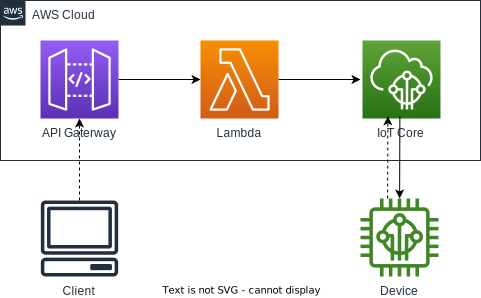

# Terraform examples

My terraform example projects.

## Projects

### [count-output](count-output)
Small code example: `output` with `count` regulated resource.

### [iot-api](iot-api)

### [lambda-go](lambda-go)

### [lambda-python](lambda-python)

### [lambda-rust](lambda-rust)

### [syntax-sandbox](syntax-sandbox)
Terraform syntax playground.
